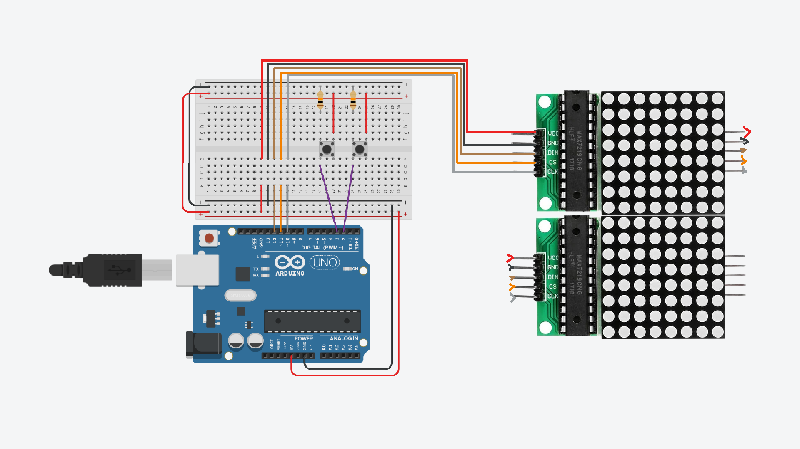

# Breakout in Arduino

Pong like game on Arduino.

## Quickstart

Assemble the parts as shown in the schematic and then connect the Arduino to
the USB. You will need some dependencies installed and to have Arduino on
/dev/ttyACM0, but other than that it should all be good to go.



```console
make build
sudo make copy
```
